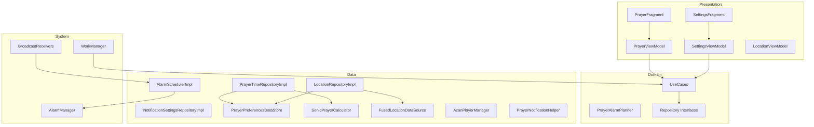

# Prayer Time Sample — Architecture

## Overview

Production-oriented **MVI + Clean Architecture** prayer notification system using **SonicOPT** for offline calculation and a rolling **AlarmManager** strategy (max 5 concurrent exact alarms).

## Layer diagram



## Folder structure

```
app/src/main/java/com/orbitalsonic/prayertimesample/
├── PrayerTimeApp.kt
├── MainActivity.kt
├── di/AppContainer.kt
├── domain/
│   ├── model/
│   ├── repository/
│   └── usecase/
├── data/
│   ├── local/PrayerPreferencesDataStore.kt
│   ├── prayer/SonicPrayerCalculator.kt
│   ├── location/FusedLocationDataSource.kt
│   ├── alarm/AlarmSchedulerImpl.kt
│   ├── notification/
│   └── repository/
├── presentation/
│   ├── common/MviViewModel.kt
│   ├── prayer/
│   ├── settings/
│   └── location/
├── receiver/
├── worker/PrayerRescheduleWorker.kt
└── lifecycle/TimeChangeLifecycleObserver.kt
```

## Alarm strategy

1. On reschedule: `PrayerAlarmPlanner.nextAlarms()` picks up to **5** future enabled prayers (today + tomorrow).
2. On trigger: `PrayerAlarmReceiver` fires notification/azan, **cancels** that alarm, schedules **next** pending prayer via `nextAlarmAfter()`.
3. After **Isha**: next alarm is **tomorrow Fajr** (via refreshed times).

Uses `AlarmManager.setExactAndAllowWhileIdle(RTC_WAKEUP, …)` when exact-alarm permission is granted.

## Single source of truth

| Data | SSOT |
|------|------|
| Prayer times | `PrayerTimeRepositoryImpl` → `StateFlow` |
| Location | `LocationRepositoryImpl` + DataStore cache |
| Settings | `PrayerPreferencesDataStore` |

## Permissions

- Location (fine/coarse)
- `POST_NOTIFICATIONS` (API 33+)
- `SCHEDULE_EXACT_ALARM` / `USE_EXACT_ALARM` (API 31+)
- Battery optimization exemption (educational UI in Settings)

## Reboot & time changes

- `BootCompletedReceiver` → `PrayerRescheduleWorker`
- `TimeChangeReceiver` (date/time/timezone)
- `TimeChangeLifecycleObserver` when app is foreground

## Testing

- Unit: `PrayerAlarmPlannerTest`, `PrayerPreferencesDataStoreTest` (Robolectric), `PrayerViewModelTest`
- Instrumentation: `PrayerNotificationFlowTest`
